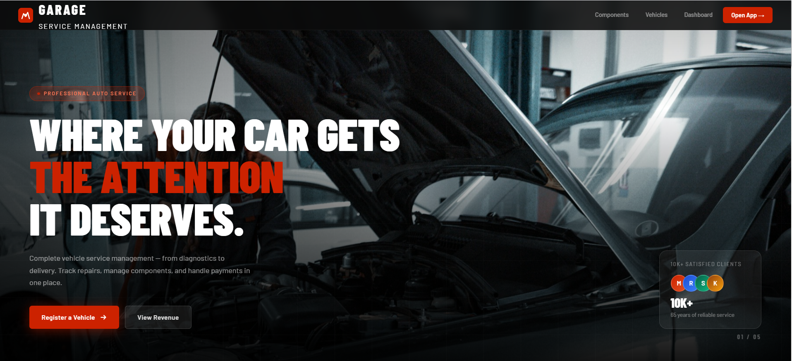
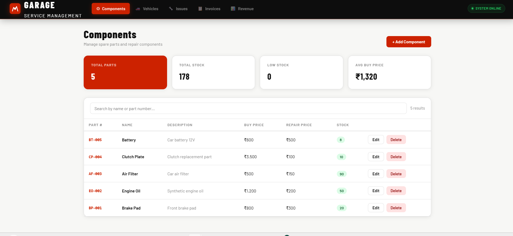

# 🚗 Vehicle Service Management System

A full-stack web application to manage vehicle servicing, repairs, components, billing, and revenue analytics.

---

## 🚀 Features

* 🔧 Component Management (add, update parts & pricing)
* 🚗 Vehicle Registration & Tracking
* 🛠 Issue Reporting (repair or new part selection)
* 🧾 Invoice Generation (automatic calculation of total cost)
* 💳 Payment Simulation (mark invoices as paid)
* 📊 Revenue Dashboard (daily, monthly, yearly graphs)
* ☁️ Full-stack deployment (Frontend + Backend)

---

## 🏗 Tech Stack

### 🔹 Backend

* Django
* Django REST Framework
* SQLite (default DB)

### 🔹 Frontend

* React.js
* Axios
* Recharts (for graphs)

### 🔹 Deployment

* Backend: Render
* Frontend: Vercel

---

## 📂 Project Structure

vehicle-service/
│
├── backend/        # Django backend
├── frontend/       # React frontend
├── README.md

---

## ⚙️ Setup Instructions

### 🔹 Backend Setup

```bash
cd backend
python -m venv venv
venv\Scripts\activate   # Windows
pip install -r requirements.txt
python manage.py migrate
python manage.py runserver
```

---

### 🔹 Frontend Setup

```bash
cd frontend
npm install
npm run dev
```

---

## 🌐 API Endpoints

| Feature          | Endpoint                |
| ---------------- | ----------------------- |
| Components       | /api/components/        |
| Vehicles         | /api/vehicles/          |
| Issues           | /api/issues/            |
| Generate Invoice | /api/invoices/generate/ |
| Payments         | /api/payments/          |
| Revenue          | /api/revenue/           |

---

## 📊 Revenue Dashboard

* Daily revenue
* Monthly revenue
* Yearly revenue
* Built using Recharts

---

## 🧪 Sample Workflow

1. Add components
2. Register vehicles
3. Add issues
4. Generate invoice
5. Make payment
6. View revenue analytics

---


### 🔹 Dashboard



### 🔹 Components Page




## 🚀 Live Demo

* Frontend: https://your-frontend-url.vercel.app
* Backend: https://your-backend-url.onrender.com

---

## 💡 Future Improvements

* Authentication system (login/signup)
* Role-based access (admin/user)
* Stock auto-update
* Email invoice system

---
